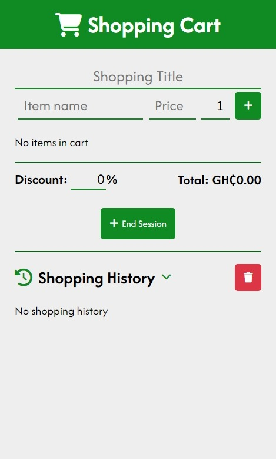

# 🛒 Shopping Cart Web Application

A lightweight, responsive shopping cart web application built with HTML, CSS, and jQuery. This application allows users to create and manage shopping sessions, track purchases, and view shopping history with support for discounts and persistent data storage.



## ✨ Features

- ✨ Create and manage shopping sessions with custom titles
- 🛍️ Add, edit, and remove items from cart
- 💰 Real-time price calculations with discount support
- 📱 Fully responsive design
- 🌓 Dark mode support
- 💾 Local storage for data persistence
- 📜 View and manage shopping history
- ♿ Accessibility features included

## 💻 Technologies Used

- HTML5
- CSS3 (with modern features like CSS Variables)
- jQuery 3.7.1
- Font Awesome 6.5.1

## 📦 Setup

1. Clone the repository:

```bash
git clone https://github.com/yourusername/shopping-cart.git
```

2. Open the project directory:

```bash
cd shopping-cart
```

3. Open `index.html` in your preferred browser.

## 📖 Usage

### Creating a Shopping Session

1. Enter a session title in the "Shopping Title" field
2. Add items to your cart:
   - Enter item name
   - Enter price
   - Set quantity (default is 1)
   - Click the "+" button to add

### Managing Items

- Adjust quantities using the number input
- Remove items using the trash icon button
- Apply discount percentage using the discount input

### Ending a Session

1. Add all desired items to cart
2. Enter session title if not already done
3. Click "End Session" to save

### Viewing History

- Click on the "Shopping History" section to expand/collapse
- Click on individual sessions to view details
- Use "Clear History" to remove all saved sessions

## 🎇Features in Detail

### Currency Handling

- All prices are displayed in Ghana Cedis (GHS)
- Proper currency formatting with thousands separators

### Date Formatting

- Dates are displayed in a readable format: "Tue, 26 Oct, 2024"
- Consistent date formatting throughout the application

### Data Persistence

- Shopping cart data persists through page refreshes
- Shopping history stored in browser's local storage
- Sessions can be retrieved even after browser restart

### Accessibility

- ARIA labels for screen readers
- Keyboard navigation support
- High contrast text and buttons
- Clear focus indicators

## 🌐 Browser Support

- Chrome (latest)
- Firefox (latest)
- Safari (latest)
- Edge (latest)

## ⚒️ Contributing

1. Fork the repository
2. Create your feature branch (`git checkout -b feature/AmazingFeature`)
3. Commit your changes (`git commit -m 'Add some AmazingFeature'`)
4. Push to the branch (`git push origin feature/AmazingFeature`)
5. Open a Pull Request

## ©️ License

This project is licensed under the MIT License - see the [LICENSE](LICENSE.txt) file for details.

## 👤 Author

Flavio Sobbin - [GitHub Profile](https://github.com/MrRyt247)

## 💫 Acknowledgments

- Font Awesome for icons
- Google Fonts for Afacad font family
- jQuery team for the awesome library
